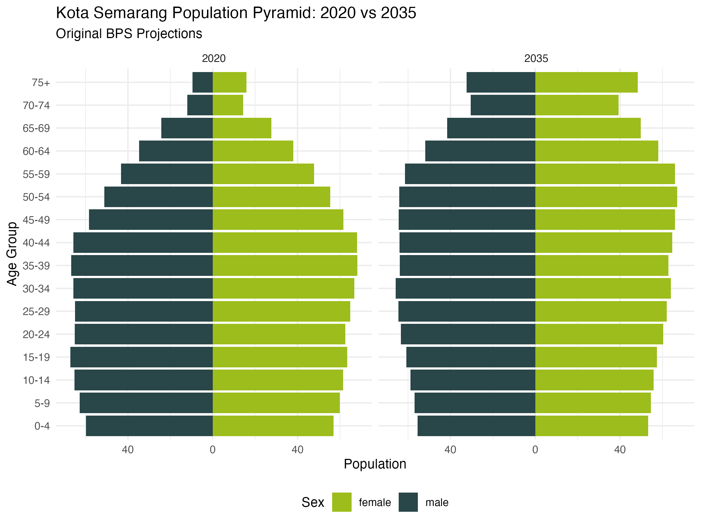
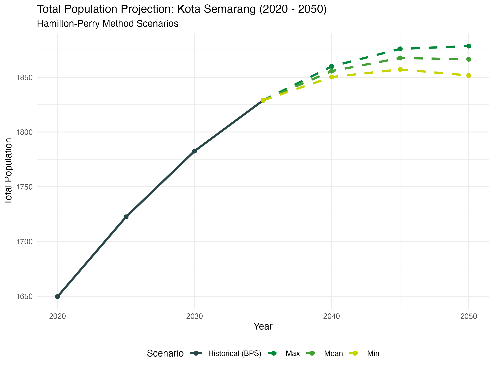
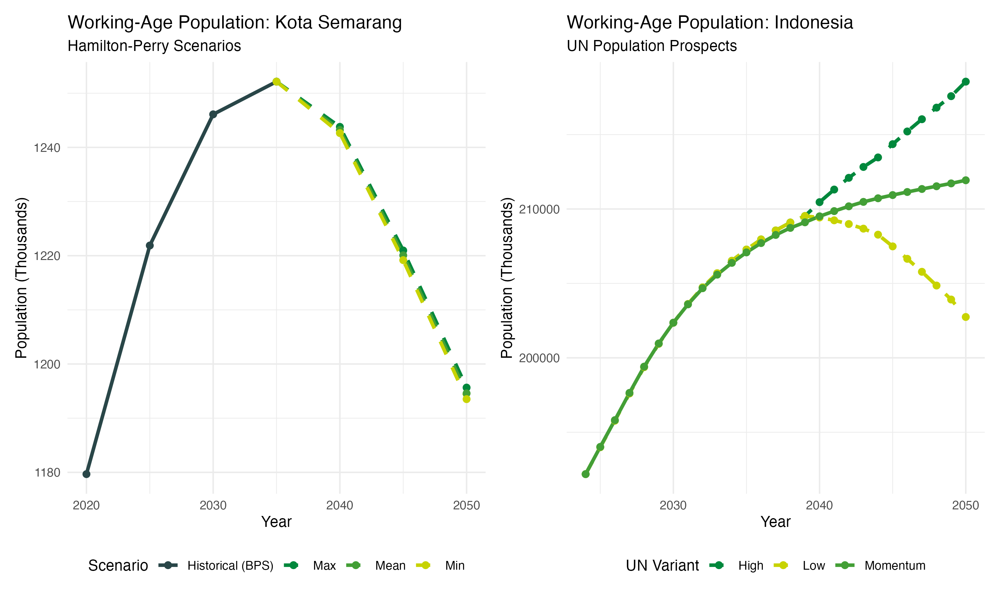

# Forecasting the Future: A Data-Driven Look at Kota Semarang's Population to 2050

If you're interested in data, demographics, or urban planning, you might have run into a very common challenge: how do we combine official—but often limited—data with future projections?

In this repository, I explore exactly that problem. I have written an R script that takes official population data and mathematically extends it 15 years into the future. I hope this code is useful for your own demographic projects or anyone looking to build a bridge between current statistics and future planning\!

## The Challenge with Official Data

Governments and statistical agencies do a fantastic job of projecting populations. For the city of Kota Semarang in Indonesia, Statistics Indonesia (BPS) provides official population projections from 2020 out to 2035\. But what happens if you are a planner, researcher, or policymaker who needs to look further ahead, say, to 2050?

Standard forecasting usually requires very detailed, local "vital rates"—things like specific birth rates, mortality rates, and migration trends for every single age group. Unfortunately, for specific cities, this granular data is rarely published; we are usually only given the final predicted population counts.

## The Hamilton-Perry Method

To bridge this gap, I used my R script to implement a clever technique called the **Hamilton-Perry Method**. It’s a method explicitly designed for situations where you know *how many* people there are in different age groups historically, but you don't have the underlying birth and death rates.

Instead of relying on those missing details, this method looks at the "demographic DNA" of the population by tracking how groups of people actually change over 5-year periods. I built the code around two simple concepts:

1. **Tracking Growth and Movement (Cohort Change Ratios):** In simple terms, this calculates what percentage of a specific age group (like 10-14 year-olds) survives and stays in the city to become the next age group (15-19 year-olds) five years later.  
2. **Estimating New Births (Child-Woman Ratios):** Since babies aren't around in the previous 5-year period for us to track, the code uses a reliable proxy for fertility by comparing the number of young children (ages 0-4) to the number of women of reproductive age.

## Embracing Uncertainty with Scenarios

Nobody can predict the future perfectly. Because the original data from 2020 to 2035 fluctuates naturally, my code analyzes these historical variations to generate three different boundaries or scenarios for 2050:

* **The Minimum Scenario:** Assumes the lowest observed ratios, which could mean slower growth, lower fertility, or more people moving away.  
* **The Mean Scenario:** A steady, "middle-of-the-road" trajectory based on mathematical averages.  
* **The Maximum Scenario:** Assumes the highest observed ratios, meaning faster growth, higher fertility, or an influx of migration.

## Visualizing the Journey to 2050

The R script doesn't just crunch the numbers; it automatically generates a series of comparative visualizations using ggplot2.

**Figure 1:** Population Pyramid
<!-- -->

**Figure 2:** Total Population Trajectory
<!-- -->

**Figure 3:** Working-Age Population Comparison
<!-- -->

## Feel Free to Use This\!

I hope this methodology and the accompanying R code (explained below) prove useful for your own regional forecasting projects\! Extending official data doesn't have to be a roadblock; with the right demographic proxies, we can confidently explore the future. Feel free to clone the repo, swap out the provided kota\_semarang\_bps\_data.csv with your own region's data, and see what the next few decades look like\!

# Technical

This repository contains an R script implementation for extending population projections using the **Hamilton-Perry Method**, specifically applied to the case study of Kota Semarang (2035–2050).

Standard demographic forecasting relies on the Cohort-Component Method (CCM), which requires highly granular vital rates (births, deaths, migration). When such granular local data is missing but historical age-sex structure data is available, the macroscopic Hamilton-Perry Method is utilized.

This script extends the official Statistics Indonesia (BPS) deterministic projections from 2035 out to 2050 via 5-year recursive steps. To properly capture uncertainty, it generates three bounding scenarios (Minimum, Mean, and Maximum) by analyzing historical survivorship and fertility proxies (Cohort Change Ratios and Child-Woman Ratios) observed between 2020 and 2035.

## Data Requirements
- `kota_semarang_bps_data.csv`: Historical population structures (used for establishing baseline ratios).
- `Indonesia_UN_estimates.csv`: Macroeconomic demographic targets derived from United Nations World Population Prospects, utilized for external benchmarking.

## Methodology

For a complete and rigorous explanation of the algebraic and demographic assumptions embedded in this model, please review the [`technical.md`](technical.md) file included in this repository.

## How to Run

1. Ensure you have R installed along with the required packages: `dplyr`, `tidyr` (`tidyverse`), `stringr`, and `patchwork`.
2. Place the required input CSV files in the project root directory.
3. Source or execute `Hamilton-Perry.R` to run the model, which will:
   - Output summary tables of total and working-age populations to the console.
   - Generate comparative visualization plots (population pyramids and progression trajectories) using `ggplot2`.

# References

* United Nations, Department of Economic and Social Affairs, Population Division (2024). World Population Prospects 2024, Online Edition. [https://population.un.org/](https://population.un.org/)  
* Proyeksi Penduduk Kabupaten/Kota Provinsi Jawa Tengah 2020-2035 Hasil Sensus Penduduk 2020\. [https://jateng.bps.go.id/id/publication/2023/07/14/373be3755ab9b902b7969101/proyeksi-penduduk-kabupaten-kota-provinsi-jawa-tengah-2020-2035-hasil-sensus-penduduk-2020-.html](https://jateng.bps.go.id/id/publication/2023/07/14/373be3755ab9b902b7969101/proyeksi-penduduk-kabupaten-kota-provinsi-jawa-tengah-2020-2035-hasil-sensus-penduduk-2020-.html)
